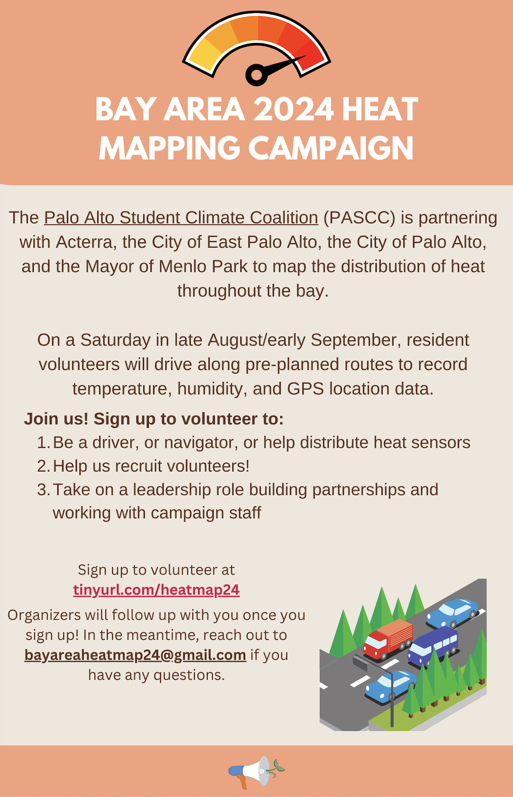

## Bay Area Heat Mapping Campaign ##

The Palo Alto Student Climate Coalition (PASCC) is partnering with Acterra, CAPA Strategies, the City of Palo Alto, the City of East Palo Alto, the Mayor of Menlo Park, Belle Haven Action, and Youth Community Service to map the distribution of heat across the Bay Area.

On one of the hottest days of the summer, a Saturday in late August or early September, volunteers will help drive and navigate around the cities of Palo Alto, East Palo Alto, and Menlo Park.

The campaign is partnering with CAPA Strategies, a company that facilitates heat mapping campaigns like this all over the world, alongside the National Oceanic and Atmospheric Administration (NOAA).

The data collected will be compiled and analyzed to help city officials better understand the underlying disparities in access to green and cool spaces. 

Climate change exacerbates and increases the incidence of extreme heat events. According to NOAA, extreme heat consistently leads to the deadliest outcomes of all weather events annually. Understanding how heat impacts our communities is becoming increasingly necessary.

