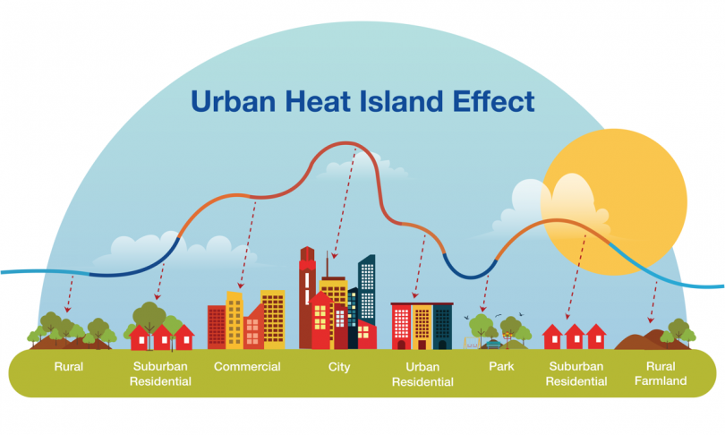

<code style="font-size:20px;">Climate change exacerbates and increases the incidence of extreme heat events. According to NOAA, extreme heat consistently leads to the deadliest outcomes of all weather events annually. Understanding how heat impacts our communities is becoming increasingly necessary.</code>

The Bay Area Heat Mapping Campaign is starting in the summer of 2024! The purpose of these campaigns is to measure the temperature and humidity across 3 cities, Menlo Park, East Palo Alto and Palo Alto. The heat mapping campaign relies on community volunteers to help capture data at three separate times on campaign day. With this data, temperature maps are created which will allow for better project design and policies that can address heat-related health issues across the region. It can also support decision makers and government officials in their urban planning and in identifying areas that are most vulnerable to heat; helping to develop policies and practices to improve the lives of Bay Area residents.

Urban areas are especially prone to high temperatures due to a combination of hard surfaces (buildings and roads), limited green spaces, and heat-producing factors like car use and industrial activity. This problem, known as the **“Urban Heat Island Effect”** , can create issues for human health, infrastructure, and quality of life. Understanding how temperatures vary based on qualities of the natural and built landscape can inform how we reduce the impacts of rising summer temperatures in our communities.

<code style="color:red;font-size:40px;font-weight:bold"> Heat Mapping Campaign for 2024! </code>

## Do you want to volunteer? Sign up and check out our Join Us page to learn more!

<iframe src="https://docs.google.com/forms/d/e/1FAIpQLSefdzT36AMtDJTZoYf4KSVVTP8T2kH7KcHr3QkAhTYELuy9bg/viewform?embedded=true" align="right" width="350" height="500" frameborder="0" marginheight="0" marginwidth="0">Loading…</iframe>

